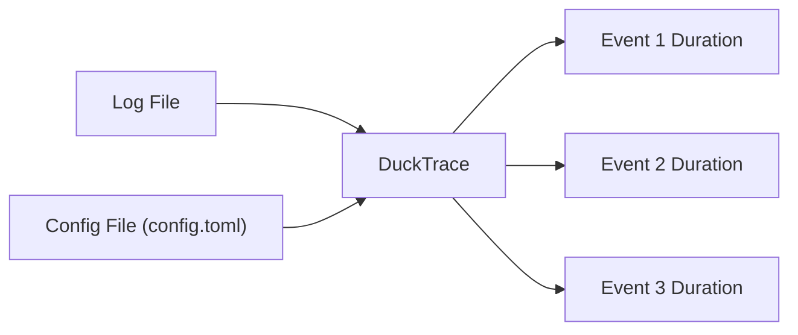
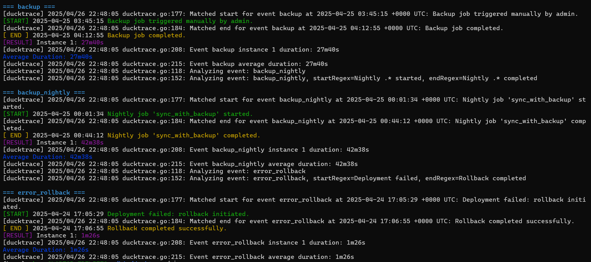

# DuckTrace - Log Duration Analysis Tool

## 🦆 Analogy: Dax the Detective Duck
Imagine your logs are a big pond, and somewhere in the reeds, important events are hiding. Dax the Duck (that’s DuckTrace!) paddles through, finding the start and end of each event, and tells you how long each one took. No more guessing where the fish are—Dax finds them and quacks the results in color!

---

## 🗺️ How DuckTrace Works (Diagram)



- **Log File**: Your application or system logs
- **config.toml**: Defines log format and events to track
- **DuckTrace**: Reads logs, finds event start/end, calculates durations
- **Output**: Colorful, easy-to-read event timing summary

---

## 🚀 Getting Started

### Requirements
- Go 1.20 or newer

### Clone & Build
```sh
git clone https://github.com/shrsv/ducktrace.git
cd ducktrace
go mod tidy
go build -o ducktrace ducktrace.go
```

### Run
```sh
./ducktrace --config config.toml --log sample.log
```

- `--config`: Path to your TOML config (see below)
- `--log`: Path to your log file

---

## 📝 Example config.toml
```toml
log_level = "debug"

[LogFormat]
pattern = '^(?P<date>\d{4}-\d{2}-\d{2}) (?P<time>\d{2}:\d{2}:\d{2}) \[(?P<level>\w+)\] (?P<message>.+)$'

[Events.backup]
start_regex = 'Backup job triggered'
end_regex = 'Backup job completed'

[Events.backup_nightly]
start_regex = 'Nightly .* started'
end_regex = 'Nightly .* completed'

[Events.error_rollback]
start_regex = 'Deployment failed'
end_regex = 'Rollback completed'
```

---

## 💡 How It Works (Plain English)
1. **Config**: You tell DuckTrace what your logs look like and what events you care about.
2. **Parsing**: DuckTrace reads your log file, line by line, using your regex to extract timestamps and messages.
3. **Matching**: For each event, it looks for lines matching your start and end patterns.
4. **Timing**: It pairs up starts and ends, calculates durations, and prints them in color for easy scanning.
5. **Summary**: You get per-instance durations and an average for each event.

---

## 🛠️ Technical Reference

### CLI Flags
- `--config <file>`: Path to TOML config (required)
- `--log <file>`: Path to log file (required)
- `--help`: Show usage

### Config File Structure
- `log_level`: Set to `debug` for verbose output
- `[LogFormat]`: `pattern` is a regex with named groups: `date`, `time`, `level`, `message`
- `[Events.<name>]`: Each event has `start_regex` and `end_regex` (regular expressions)

### Output
- Events are shown with colored headers
- Each match prints the timestamp and message
- Durations and averages are highlighted for quick reading

---

## 🦆 Example Output

You can see the durations highlighted in easy to read colors:



---

## 🧩 Extending DuckTrace
- Add more events in your config.toml
- Adjust regexes to match your log format
- Use the colorized output to quickly spot slow or failed events

---

## 🦆 Happy Tracing!
Let Dax the Duck paddle through your logs and bring you the answers you need—fast, friendly, and in full color!
